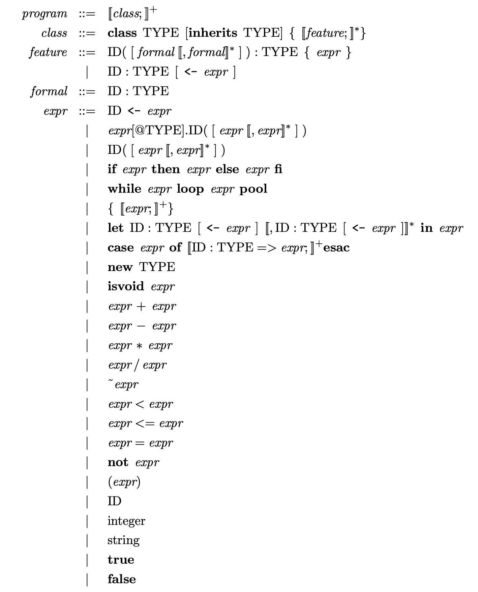

##  -------------------------------
##  Group 01
##  E/17/194 Madhushan R.
##  E/17/338 Srimal R.M.L.C.
##  -------------------------------

README file for Programming Assignment 3 (C++ edition)
======================================================

Your directory should now contain the following files:

 Makefile
 README
 cool.y
 bad.cl
 good.cl
 cool-tree.handcode.h
 cool-tree.cc		  -> [cool root]/src/PA3/cool-tree.cc
 cool-tree.aps		  -> [cool root]/src/PA3/cool-tree.aps
 dumptype.cc		  -> [cool root]/src/PA3/dumptype.cc
 handle_flags.c           -> [cool root]/src/PA3/handle_flags.cc
 parser-phase.cc	  -> [cool root]/src/PA3/parser-phase.cc
 stringtab.cc		  -> [cool root]/src/PA3/stringtab.cc
 tokens-lex.cc		  -> [cool root]/src/PA3/tokens-lex.cc
 tree.cc		  -> [cool root]/src/PA3/tree.cc
 utilities.cc		  -> [cool root]/src/PA3/utilities.cc
 *.d			  dependency files
 *.*			  other generated files

The include (.h) files for this assignment can be found in 
[cool root]/include/PA3

	The Makefile contains targets for compiling and running your
	program. DO NOT MODIFY.
    
	The README contains this info. Part of the assignment is to
	fill in the README with the write-up for your project. You should
	explain design decisions, explain why your code is correct, and why
	your test cases are adequate. It is part of the assignment to
	clearly and concisely explain things in text as well as to comment
	your code. Just edit this file.

	cool.y is the skeleton for the parser specification that you
	are to write. It already contains productions for the program
	and the classes. Use them as an example to write the remaining
	productions.  You should also read the bison documentation.
	This skeleton will compile and run as is, but it doesn't
	do much.

	good.cl, bad.cl test a few features of the grammar. You should
	add tests to ensure that good.cl exercises every legal
	construction of the grammar and that bad.cl exercises as many
	different parsing errors as you can squeeze into one file.

	cool-tree.aps contains the definitions for the tree language
	which you use to construct the abstract syntax tree (AST).
	From this file, cool-tree.h and cool-tree.cc are automatically 
        generated by a utility that compiles the specification into
        C++ functions for producing and consuming the tree nodes.
        This file is provided for your reference.  DO NOT MODIFY.

        tree.{cc|h} contain definitions used by the tree package.
        cool-tree.handcode.h is the handwritten extension to
        cool-tree.h.  If you read cool-tree.h and cool-tree.cc, you will
        note that there are "hooks" for extending the classes
        declarations.  Extending and modifying the tree package is
        discussed in the "Cool Tour", but you do not need to (and should
        not) modify the tree package for this assignment.

	tokens-lex.cc is a lexer capable of reading a token stream from
	console in the format produced by the lexer phase. DO NOT
	MODIFY.

        parser-phase.cc contains a driver to test the parser. DO NOT
        MODIFY.

	dumptype.cc prints the AST out in a form readable by the
	semant phase of the compiler. DO NOT MODIFY.

	handle_flags.cc implements routines for parsing command line
        flags. DO NOT MODIFY.

        The rest of the files are created as byproducts of `bison'.
        `cool-parse.cc' is the generated C++ file containing the
        parser.

	Files not discussed are covered in the README for PA2.

Instructions
------------

	To compile your parser program type:

	% make parser

	This produces an executable named "parser" which is standalone
	phase of the Cool compiler.  It requires lexer, semant, and cgen
	to do anything useful.

	To test your parser on a file 'foo.cl' type

	% myparser foo.cl

	myparser is a shell script that "glues" together lexer and
	parser using pipes.

	To run your parser on the files good.cl and bad.cl type:

	% make dotest

	To run the (provided) lexer and your parser on a file called test.cl type:

	% ./lexer test.cl | ./parser

	If you think your parser is correct and behaves like
	the one we wrote, you may want to run a COOL compiler using
	your parser:

	% mycoolc foo.cl

	To overwrite the default lexical analyzer with yours, replace 
	lexer (which is a symbolic link to the "official" lexer) with
        your lexer from PA2.

	If you change architectures you must issue

	% make clean

	when you switch from one type of machine to the other.
	If at some point you get weird errors from the linker,	
	you probably forgot this step.

	GOOD LUCK!

---8<------8<------8<------8<---cut here---8<------8<------8<------8<---

Write-up for PA3
----------------

## **Precedence declarations:**

        Three types of Precedence,

                1) Left associative - Priority level of the precedence is,
                        .
                        @
                        ~
                        ISVOID
                        * /
                        + -
                        < =
                        NOT

                2) Right associative
                        LET & ASSIGN are the only right right associative precedence

                3) Non associative
                        LE , <  and =  haven't priority level

                Therefore precidece can be decalred as,
                    %precedence LETEXP
                %right ASSIGN
                %precedence NOT
                %nonassoc '<' '=' LE
                %left '+' '-'
                %left '*' '/'
                %precedence ISVOID
                %precedence '~'
                %precedence '@'
                %precedence '.'

## **Grammar Rules:**

        The rules for COOL programming language are defined in here.

        * Description of each rule *

                ---program
                        Already implemented in the skeleton code.
                        Program contains class_list (one or more classes)

                ---class_list
                        Already implemented in the skeleton code.
                        class_list is a non-terminal which contains atleast one class.

                ---class
                        Describes productions of a class. class may have zero or more features.
                        There are two types of classes,
                                (i) Without a parent
                                        class TYPE { feature_list };
                                (ii) With a parent
                                        class TYPE inherits TYPE { feature_list };
                        If an error is found next to class, it is skipped.

                ---feature
                        There are two types of features,
                        (i) methods
                                OBJECTID '(' formal_list ')' ':' TYPEID '{' expression '}' ';'
                        (ii) attributes without initilization
                                OBJECTID ':' TYPEID ';'
                        (iii) attributes with initilization
                                OBJECTID ':' TYPEID ASSIGN expression ';'

                ---feature_list
                		feature_list may consist of empty or non-empty feature_list
                		If an error is found in one feature, it is skiped and parsing is started from next feature.

                ---non_empty_feature_list
                		Defined to handle shift/reduce conflict
                		It may consist of one or more features. 

                ---formal
                		Production for a formal as follows
						ID : TYPE

                ---formal_list
               			A formal list can be empty.
						Or it contains one or more comma seperated formals.

                ---expression_block
                		a single line expression inside a { } block

                ---expressions_block
                		one or more expressions inside a { } block
                		If an error is found in one feature, it is skiped.

                ---expressions_list
                		it contains one or more comma seperated expression_blocks.

                ---expression
                		all possible expressions as mentioned in cool manual

## **Testing:**

        Maximum possible test cases are tested using good.cl and bad.cl. All the COOL programs in examples directory, used to test the parser for error-free programs. bad.cl contains an errorness COOL program to check following conditions,
                (1) Errors in features in classes
                (2) Error in blocks
                (3) Errors in the let expression
                (4) Errors in variable list and the body
                (5) Error in a the variable list
        All possible testcases are giving the same results as the inbuild parser results.Parser is compiled without any confilcts.

## **Context Free Grammer for COOL** ##
 

	Constructed CFG rules according to the above cool syntax defined in cool manual.

## **Handling Shift/Reduce & Reduce/Reduce Conflicts** ##

When feature_list can be further reduced to an empty features, a derivation can unnecessarily go on a loop of reductions.

	Example: • OBJECTID '(' ')' ':' TYPEID '{' expression '}' ';'
	Shift derivation
		feature_list
		↳ 14: feature
			↳ 7: • OBJECTID '(' formal_list ')' ':' TYPEID '{' expression '}' ';'
								↳ 7: ε
	Reduce derivation
		feature_list
		↳ 15: feature_list feature
			↳ 13: ε •    ↳ 7: OBJECTID '(' formal_list ')' ':' TYPEID '{' expression '}' ';'
	
This conflict was eliminated by defining a non-empty feature_list derivation seperately since empty feature is also acceptable at some cases in COOL.

In a LET expression the `expression` in the `IN expression` clause can be shifted or reduced. 

	Example: LET OBJECTID ':' TYPEID let_assign IN expression • '.' OBJECTID '(' ')'
	Shift derivation
		expression
		↳ 50: LET let_expression
				↳ 39: OBJECTID ':' TYPEID let_assign IN expression
														↳ 46: dispatch
																↳ 22: expression • '.' OBJECTID '(' ')'
	Reduce derivation
		expression
		↳ 46: dispatch
			↳ 22: expression                                                     '.' OBJECTID '(' ')'
					↳ 50: LET let_expression
							↳ 39: OBJECTID ':' TYPEID let_assign IN expression •

By default, bison shifts instead of reducing, which is preferred in COOL syntax. As mentioned in cool manual,  
`let <id1> : <type1> [ <- <expr1> ], ..., <idn> : <typen> [ <- <exprn> ] in <expr>`  
The `<expr>` of a let extends as far (encompasses as many tokens) as the grammar allows.

To eleminate the conflict, `%prec SPECIAL_TOKEN` has been added to `IN expression` grammer rule and given the lowest precedence to `SPECIAL_TOKEN` to capture all possible tokens in an expression (`<expr>`).